# Architecture & Data Flow Diagrams

This document contains comprehensive diagrams for the Ollama Automation Harness system architecture, data flows, and component interactions.

> **Note**: These diagrams use Mermaid syntax and can be rendered by GitHub, GitLab, VS Code, and other Markdown tools.

---

## Table of Contents

1. [System Context Diagram](#1-system-context-diagram)
2. [Component Architecture Diagram](#2-component-architecture-diagram)
3. [Module Dependency Diagram](#3-module-dependency-diagram)
4. [Main Workflow Sequence Diagram](#4-main-workflow-sequence-diagram)
5. [Classification Flow Diagram](#5-classification-flow-diagram)
6. [Permission Enforcement Flow](#6-permission-enforcement-flow)
7. [Execution Pipeline Diagram](#7-execution-pipeline-diagram)
8. [Error Handling Flow](#8-error-handling-flow)
9. [Security Layers Diagram](#9-security-layers-diagram)
10. [State Machine Diagram](#10-state-machine-diagram)
11. [Deployment Architecture](#11-deployment-architecture)
12. [Data Model Diagram](#12-data-model-diagram)

---

## 1. System Context Diagram

Shows the harness in relation to external systems and actors.

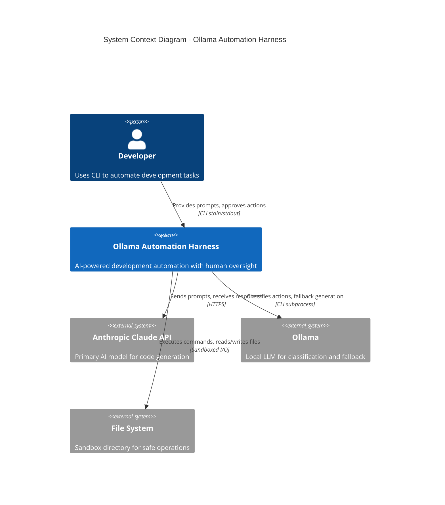

### Simplified Version (Standard Mermaid)

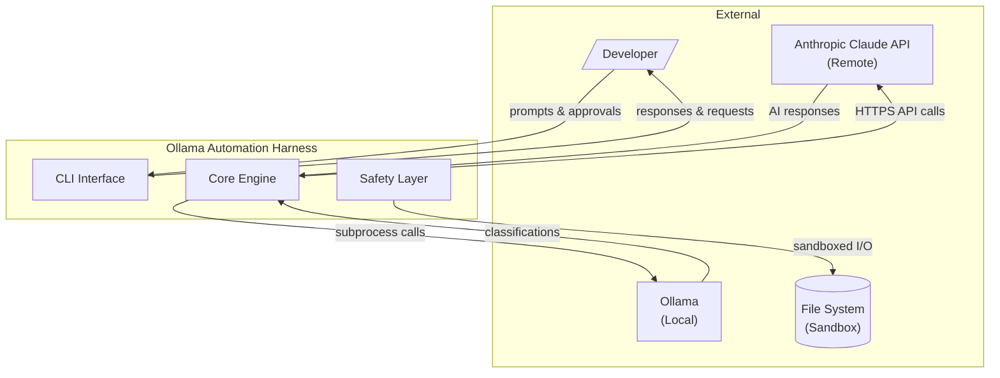

---

## 2. Component Architecture Diagram

Shows internal components and their relationships.

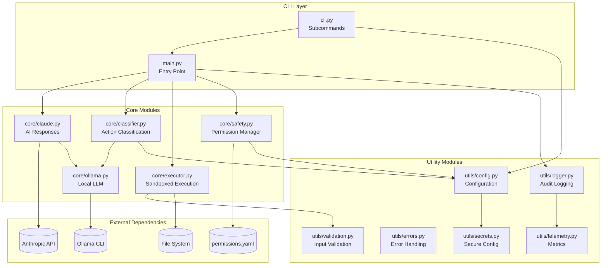

---

## 3. Module Dependency Diagram

Shows import relationships between modules.

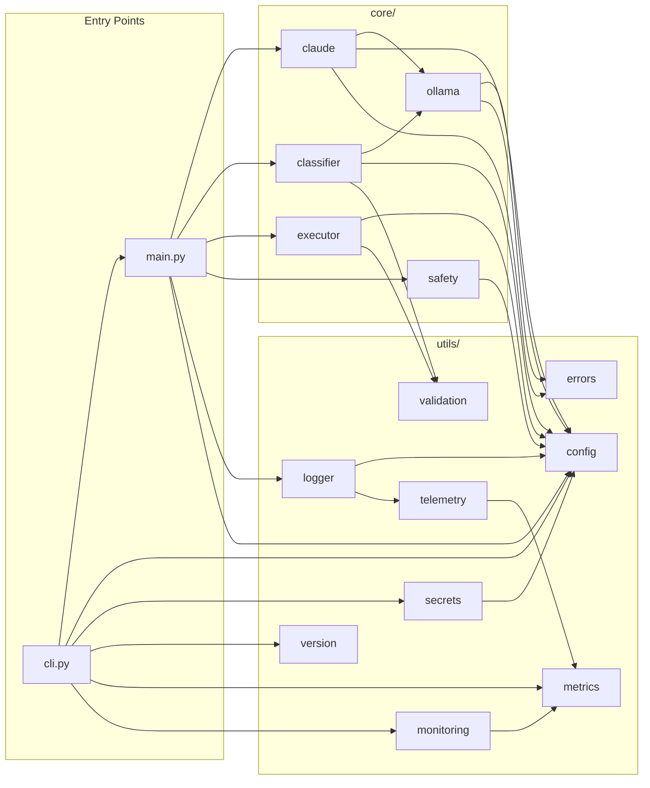

---

## 4. Main Workflow Sequence Diagram

Shows the complete request-response cycle.

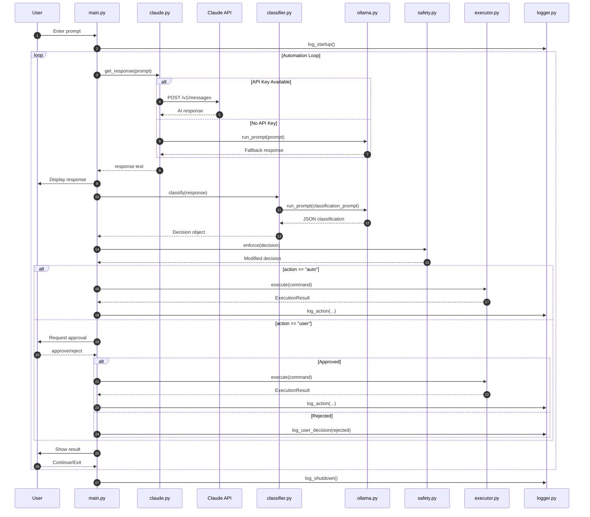

---

## 5. Classification Flow Diagram

Shows how responses are classified into decisions.

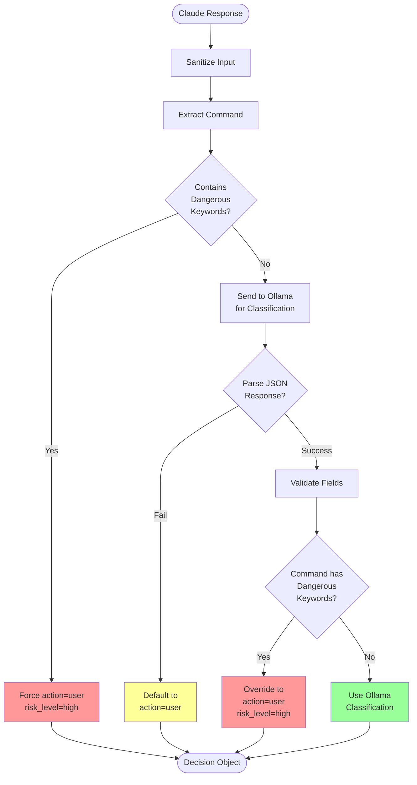

---

## 6. Permission Enforcement Flow

Shows how permissions modify decisions.

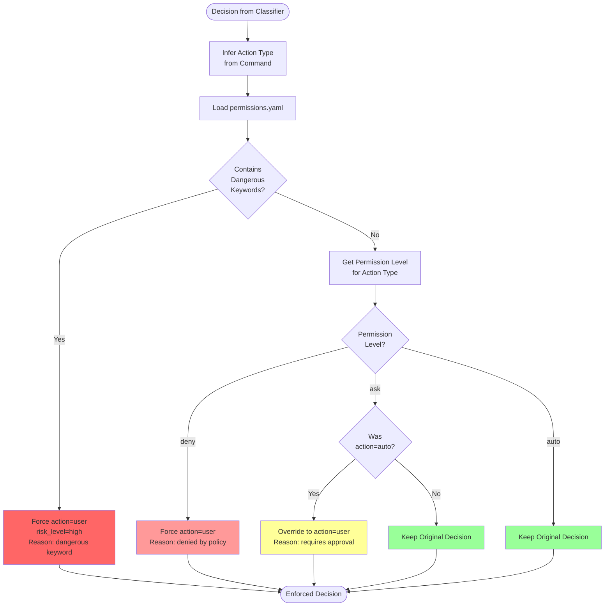

---

## 7. Execution Pipeline Diagram

Shows the sandboxed execution process.

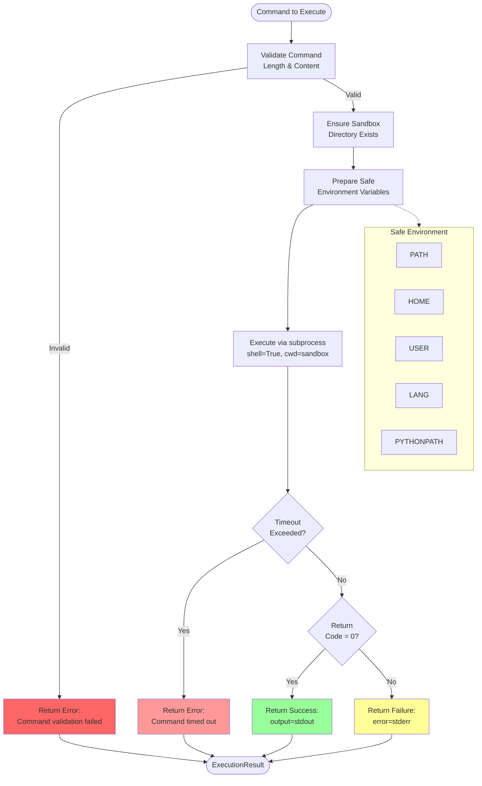

---

## 8. Error Handling Flow

Shows how errors propagate through the system.

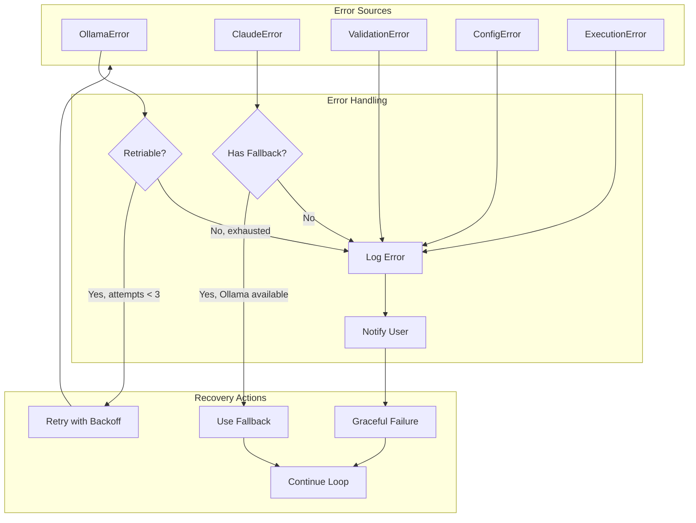

---

## 9. Security Layers Diagram

Shows the defense-in-depth security architecture.

```mermaid
flowchart TB
    subgraph Layer1["Layer 1: Input Validation"]
        L1A[Prompt Length Check<br/>max 10,000 chars]
        L1B[Command Length Check<br/>max 1,000 chars]
        L1C[String Sanitization]
        L1D[Path Traversal Detection]
    end

    subgraph Layer2["Layer 2: Keyword Detection"]
        L2A[Dangerous Keywords List]
        L2B[Real-time Scanning]
        L2C[Force User Action]
    end

    subgraph Layer3["Layer 3: AI Classification"]
        L3A[Ollama Risk Assessment]
        L3B[JSON Validation]
        L3C[Risk Level Assignment]
    end

    subgraph Layer4["Layer 4: Permission Enforcement"]
        L4A[YAML Policy Rules]
        L4B[Action Type Matching]
        L4C[Decision Override]
    end

    subgraph Layer5["Layer 5: User Approval"]
        L5A[Interactive Confirmation]
        L5B[Explicit Consent]
        L5C[Rejection Option]
    end

    subgraph Layer6["Layer 6: Sandbox Execution"]
        L6A[Directory Restriction]
        L6B[Extension Whitelist]
        L6C[Timeout Enforcement]
        L6D[Safe Environment]
    end

    subgraph Layer7["Layer 7: Audit Logging"]
        L7A[Action Logging]
        L7B[Decision Logging]
        L7C[Error Logging]
        L7D[User Decision Logging]
    end

    Input([User Input]) --> Layer1
    Layer1 --> Layer2
    Layer2 --> Layer3
    Layer3 --> Layer4
    Layer4 --> Layer5
    Layer5 --> Layer6
    Layer6 --> Layer7
    Layer7 --> Output([Logged Result])

    style Layer1 fill:#e3f2fd
    style Layer2 fill:#fff3e0
    style Layer3 fill:#f3e5f5
    style Layer4 fill:#e8f5e9
    style Layer5 fill:#fce4ec
    style Layer6 fill:#e0f7fa
    style Layer7 fill:#f5f5f5
```

---

## 10. State Machine Diagram

Shows the application states and transitions.

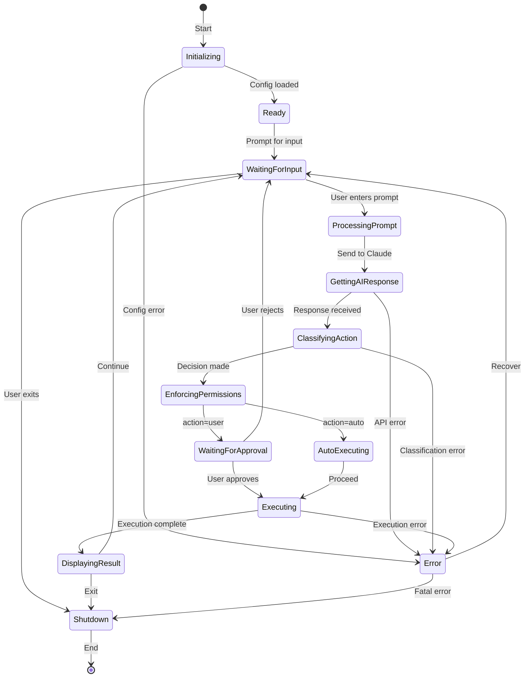

---

## 11. Deployment Architecture

Shows how the application can be deployed.

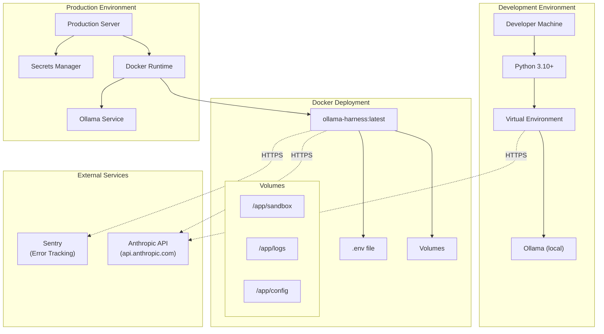

---

## 12. Data Model Diagram

Shows key data structures and their relationships.

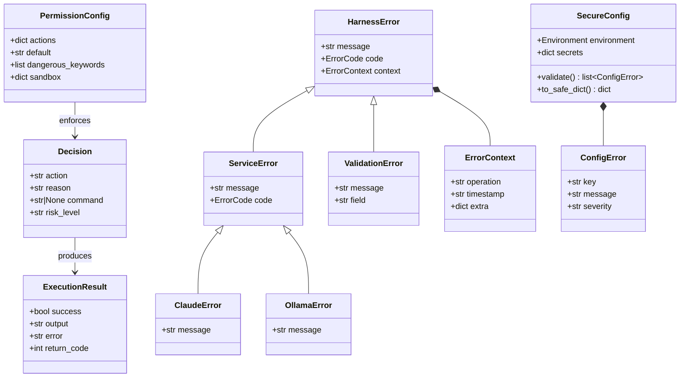

---

## Data Flow Summary

### Request Flow

```
User Input → Validation → Claude API → Classification → Permission Check → Execution → Logging → Output
```

### Data Transformation

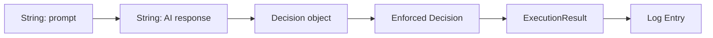

---

## Diagram Legend

| Symbol | Meaning |
|--------|---------|
| Rectangle | Process/Module |
| Diamond | Decision Point |
| Cylinder | Database/Storage |
| Stadium | Start/End |
| Parallelogram | Input/Output |
| Green Fill | Success Path |
| Yellow Fill | Warning/Caution |
| Red Fill | Error/Block |

---

*Last updated: 2024-01-15*
